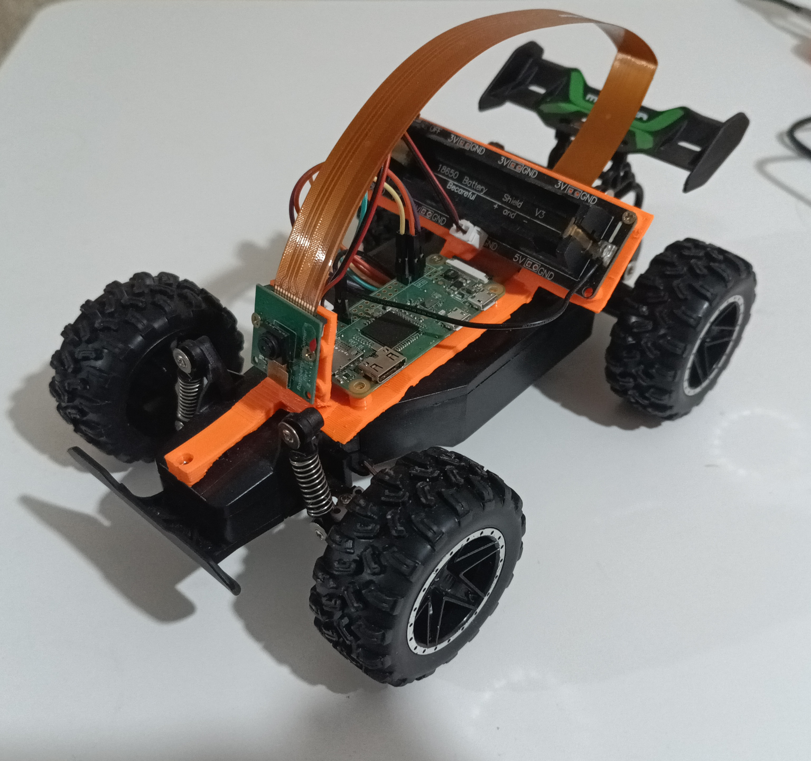

# raspi-car

Raspberry Pi Zero layer for an RC car with live video streaming and web-based controls.

## Components

- **gpiosrv** — Rust (Rocket) websocket server that drives motors via GPIO/pigpio. Also contains pin configuration
- **Web UI** — Browser-based control panel with WASD keys and live WebRTC video feed
- **mediamtx** — Video streaming server using GStreamer and the Pi's V4L2 camera
- **Caddy** — Reverse proxy serving the web UI
- **balena-wifi-connect** — Captive portal for Wi-Fi setup

## Usage

### Build an SD card image:

Install yocto + its dependencies + kas

Optional: Uncomment SSH_AUTH_PUBKEY and replace ssh key in `kas.yml` with your own before building

```sh
kas build kas.yml
```

Flash the image, boot, and wait for a `raspi-car` wifi network to appear. Enter the captive portal and select the actual wifi network that it should connect to

Connect via http and drive

### Deploy updates over SSH:

* Uncomment SSH_AUTH_PUBKEY and replace ssh key in `kas.yml` with your own
* Add rpicar-ota distro feature by uncommenting a line in `kas.yml`
* `kas build --target rpicar-image-update`
* find the built image
* `cat imagename.swu | ssh root@raspi-car swupdate -i /dev/stdin -H raspberrypi0-wifi:1.0 -e stable,copy2`
* (on a second update `stable,copy2` should be replaced with `stable,copy1`, and then alternated)

## Notes on security

This is a hobby project, so authentication was not a huge consideration. SSH login is pubkey only, but the control web page is unauthenticated, so anyone who can connect to it can drive the car. OTA updates also do not use signing.

## Notes on latency

The current implementation achieves ~300ms of camera-to-screen latency on a good wifi connection.
It is possible to get lower than that but likely not in a browser. FPS is also limited to about 15 - this is likely caused by mediamtx having to repackage stuff between stream formats, which hits the CPU bottleneck.

The theoretical best option is RTP directly from gstreamer to e.g. mpv with low-latency profile. This also allows higher FPS (at least 30, maybe slightly more), which improves visuals. All in all the RTP setup achieved latency of about 150ms. (not included here but would look something like this: `gst-launch-1.0 v4l2src ! video/x-h264, width=800, height=600, framerate=30/1 ! h264parse ! rtph264pay config-interval=1 pt=96 ! udpsink host=... port=...`)

## NixOS

There is also a NixOS version in the `nixos` branch. It's easier to develop for and do OTA updates, but takes much longer to boot

## Photo


